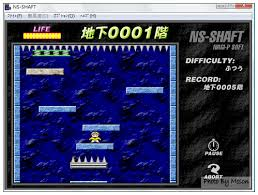

# 第六組

# 小組成員:

## 許萌祐 0652015
## 蔡鎮有 0652036
## 陳信瑀 0652067
## 盧佳箴 0623057
## 楊雁如 0641047
## 郭允蓉 0641107

# 專案主題:

## 小恐龍下樓梯

# 專案簡介:

## 我們將以大家所熟悉的小朋友下樓梯作為這次專案的基底，
## 把背景改為電路圖、樓梯為金幣、恐龍身上背了送貨的包包及帽子，
## 以代表小組成員的系別，包括電子系、金融系和運籌系。

# 專案畫面簡介:

